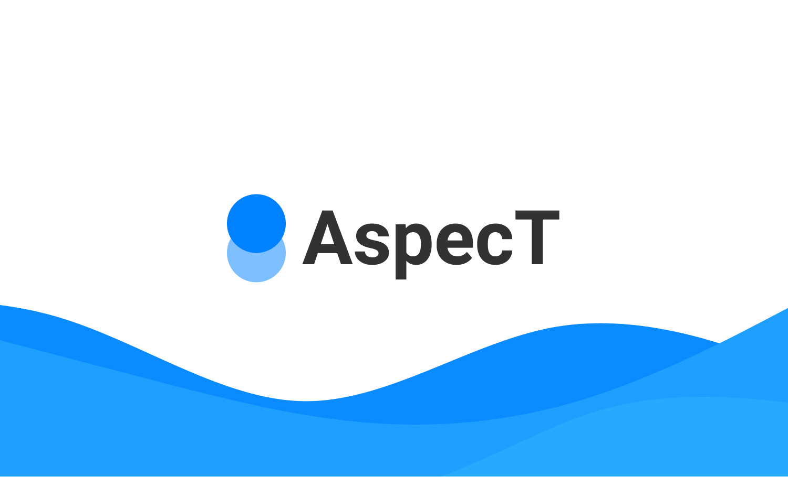

# AspecT-Backend

Aspect Backend
## About
 Motivation behind this project is, we care about indonesian for make it better next generation 


## Feature V1
-   Track all kid's bad words text
-   Add New Children to Monitorize
-   Report Daily, Weekly, Montly Progress
-   Achievement Good progress children (Soon)
-   Autotext Good Word (Soon)
## Documentation
Before start the project localy, make sure to all tools has been installed on your machine such:

- [X]    Golang

- [X]    Python

- [X]    Docker

#### HOW TO RUN
##### GOLANG

```bash
cd backend/apps
```
```bash
make run
```

##### PYTHON
to build image for docker
```bash
make build

```

to run the image as container

```bash
make run
```

stop the container
```bash
make stop
```

remove image 
```bash
make remove
```

## Resources

## Todo's
- [ ] Account Service

- [ ] Auth Service

- [ ] Children Service

- [ ] Profanity Service

- [ ] Reporting Service

- [ ] AI Service (using AI Google Platform)


## Team

@xxidbr9