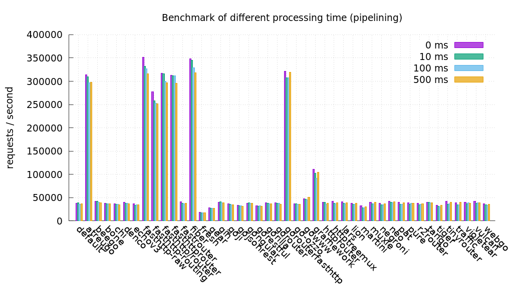

# AspecT-Backend

Aspect Backend

## About
 Motivation behind this project is, we care about indonesian for make it better next generation 


## Feature V1
-   Track all kid's bad words text
-   Add New Children to Monitorize
-   Report Daily, Weekly, Montly Progress
-   Achievement Good progress children (Soon)
-   Autotext Good Word (Soon)
## Documentation
Before start the project localy, make sure to all tools has been installed on your machine such:

- [X]    Golang

- [X]    Python

- [X]    Docker


## About The Project(Technical)
#### Apps (Service)
> You may ask why we use golang?

we use golang because it's FAST, and the framework we use for this project is called [fiber](https://github.com/gofiber/fiber), the fastest and rapid development server build for golang and inspired by express.js. 
just take a look at this benchmark

> benchmark from other framework

for the archicteture it self, we use DDD/Hexagonal in golang, and use Event Driven Architecture for build microservice between each service [See reference here](https://github.com/Anak-Spectator/AspecT-Backend#reference)


#### ML (Service)
we use python (flask) as ml service, and bridging all request straight to the AI Platform, but for now, we still under development, it soon will replace all mock service with the full feature of the service.

in ml service, we implement MVC pattern for the project architecture [See reference here](https://github.com/Anak-Spectator/AspecT-Backend#reference)

#### Reference
-   [DDD](https://engineering.grab.com/domain-driven-development-in-golang)
-   [Event Driven](https://medium.com/bliblidotcom-techblog/event-driven-architecture-ef3a312180ee)
-   [Microservice](https://www.nginx.com/blog/microservices-at-netflix-architectural-best-practices/)
-   [MVC](https://shravan-c.medium.com/mvc-for-flask-application-a636e6f58d72)

#### Additional Tool's / Package / Libs / Module and Service
- [Apps](https://github.com/Anak-Spectator/AspecT-Backend/blob/master/backend/apps/go.mod)
- [ML](https://github.com/Anak-Spectator/AspecT-Backend/blob/master/backend/ml/requirements.txt) => **(mock server)**
- [AI](https://github.com/Anak-Spectator/AspecT-ML)


#### HOW TO RUN
##### GOLANG

```bash
cd backend/apps
```
```bash
make run
```

##### PYTHON
to build image for docker
```bash
make build

```

to run the image as container

```bash
make run
```

stop the container
```bash
make stop
```

remove image 
```bash
make remove
```

## Resources

## Todo's Apps
- [ ] Account Service

- [ ] Auth Service

- [ ] Children Service

- [ ] Profanity Service

- [ ] Reporting Service

- [ ] Bride AI Service (using AI Google Platform) to internal ML service


## Team

-   [@xxidbr9](https://github.com/xxidbr9) 
    -   fullname    : Barnando Akbarto Hidayatullah (Nando)
    -   [linkedin](https://linkedin.com/in/xxidbr9)
-   [@M4RIONETTE](https://github.com/M4RIONETTE)
    -   fullname : Fajar Nur Hidayatullah (Fajar)
    -   [linkedin](https://www.linkedin.com/in/marionette/)
